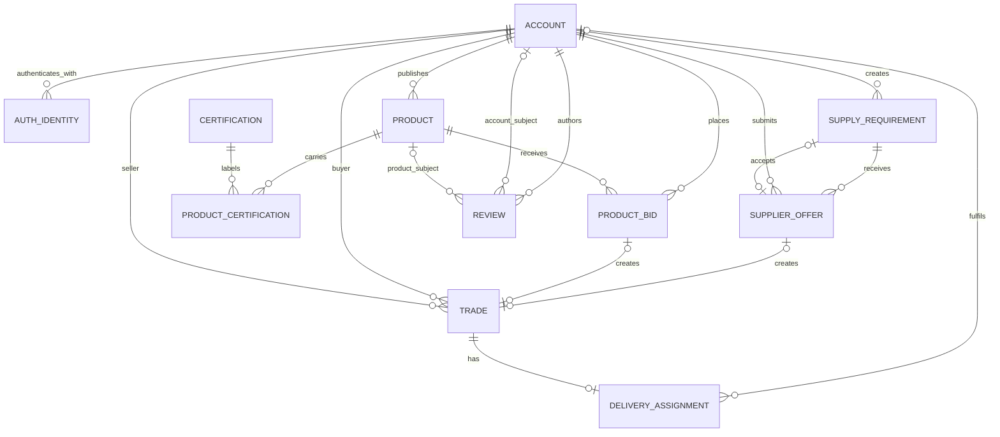

# HarvestLink data model

## Purpose

This document defines the durable data model for moving HarvestLink from browser `localStorage` to a persistent relational database. PostgreSQL is the assumed target, although the relationships and constraints also apply to other SQL databases.

The current prototype uses compact embedded objects. The persistent model normalizes bids, certifications, authentication identities, and reviews so they can be queried, audited, and updated safely.

## Modeling principles

- A HarvestLink account represents a business or trading party, not an individual login.
- An account has exactly one primary role in the first production version: `seller`, `customer`, or `delivery`.
- Authentication identifiers are separate from the business account so email and phone sign-in can coexist.
- Money is stored as an integer in the currency's smallest supported unit. For the current LKR-only product, whole LKR integers are sufficient.
- Product bids and supplier offers are immutable submissions except for an explicit update operation that records an audit event.
- Reviews identify both their author and one concrete subject: either a product or another account.
- Aggregate rating values are cached for reads but are derived from review rows.
- Accepted offers are represented by a status transition and a reference to the selected offer.
- All timestamps are UTC in storage and converted for display at the application boundary.
- Records that participate in trade history should normally be archived, not physically deleted.

## Entity relationship diagram



## Core entities

### `accounts`

Business identity used throughout the marketplace.

| Column | Type | Required | Notes |
| --- | --- | --- | --- |
| `id` | UUID | Yes | Primary key |
| `name` | VARCHAR(160) | Yes | Public business name |
| `role` | ENUM | Yes | `seller`, `customer`, or `delivery` |
| `location` | VARCHAR(160) | No | Public operating location |
| `phone` | VARCHAR(32) | No | Store normalized E.164 value when supplied |
| `email` | VARCHAR(254) | No | Store normalized lowercase value |
| `initials` | VARCHAR(4) | No | Presentation fallback; may be derived |
| `avatar_url` | TEXT | No | Future replacement for prototype color avatars |
| `avatar_color` | VARCHAR(16) | No | Prototype-compatible presentation field |
| `rating_average` | NUMERIC(2,1) | Yes | Cached aggregate, default `0.0` |
| `rating_count` | INTEGER | Yes | Cached aggregate, default `0` |
| `status` | ENUM | Yes | `pending`, `active`, `suspended`, `archived` |
| `created_at` | TIMESTAMPTZ | Yes | UTC |
| `updated_at` | TIMESTAMPTZ | Yes | UTC |

Constraints:

- At least one verified authentication identity must exist before `status` can become `active`.
- `rating_average` is between 0 and 5; `rating_count` is non-negative.
- Phone and email visibility should be controlled by an explicit profile/contact policy in production.

### `auth_identities`

Login methods associated with an account.

| Column | Type | Required | Notes |
| --- | --- | --- | --- |
| `id` | UUID | Yes | Primary key |
| `account_id` | UUID | Yes | Foreign key to `accounts.id` |
| `type` | ENUM | Yes | `email` or `phone` |
| `normalized_value` | VARCHAR(254) | Yes | Lowercase email or E.164 phone |
| `verified_at` | TIMESTAMPTZ | No | Null until OTP/link verification |
| `created_at` | TIMESTAMPTZ | Yes | UTC |

Use a unique constraint on `(type, normalized_value)`. Never store raw OTP codes; store a short-lived salted hash in a separate verification-challenge store.

### `products`

Agricultural lots published by sellers.

| Column | Type | Required | Notes |
| --- | --- | --- | --- |
| `id` | UUID | Yes | Primary key |
| `seller_id` | UUID | Yes | Foreign key to a seller `account` |
| `title` | VARCHAR(180) | Yes | Searchable |
| `description` | TEXT | Yes | Quality, packing, and condition |
| `category` | VARCHAR(80) | Yes | Replace with category table if taxonomy grows |
| `base_price_lkr` | INTEGER | Yes | Must be greater than zero |
| `current_bid_lkr` | INTEGER | Yes | Cached highest valid bid |
| `unit` | VARCHAR(32) | Yes | Examples: `kg`, `each`, `box`, `crate` |
| `quantity_text` | VARCHAR(100) | Yes | Prototype-compatible display value |
| `quantity_value` | NUMERIC(14,3) | No | Recommended normalized quantity |
| `image_url` | TEXT | No | Validate scheme and host policy |
| `rating_average` | NUMERIC(2,1) | Yes | Cached aggregate |
| `rating_count` | INTEGER | Yes | Cached aggregate |
| `bid_closes_at` | TIMESTAMPTZ | No | Replaces display-only countdown |
| `status` | ENUM | Yes | `draft`, `open`, `awarded`, `closed`, `archived` |
| `created_at` | TIMESTAMPTZ | Yes | UTC |
| `updated_at` | TIMESTAMPTZ | Yes | UTC |

Only active seller accounts can publish products. `current_bid_lkr` must equal the base price when no valid bids exist and otherwise equal the highest valid bid.

### `certifications` and `product_certifications`

Certification labels are normalized rather than stored as a string array.

`certifications` contains `id`, unique `slug`, `display_name`, optional `description`, optional `verification_required`, and `status`.

`product_certifications` contains `product_id`, `certification_id`, optional `evidence_url`, optional `verified_at`, and optional `verified_by_account_id`. Use `(product_id, certification_id)` as the primary key.

Labels such as “Fresh” or “Local” may be claims rather than formal certifications. A future `label_type` column can distinguish `claim`, `certification`, and `harvest_attribute`.

### `product_bids`

Customer bids on published products.

| Column | Type | Required | Notes |
| --- | --- | --- | --- |
| `id` | UUID | Yes | Primary key |
| `product_id` | UUID | Yes | Foreign key to `products.id` |
| `buyer_id` | UUID | Yes | Foreign key to a customer account |
| `amount_lkr` | INTEGER | Yes | Must exceed the current bid at submission |
| `status` | ENUM | Yes | `active`, `outbid`, `accepted`, `withdrawn`, `rejected` |
| `created_at` | TIMESTAMPTZ | Yes | Server-generated UTC |
| `updated_at` | TIMESTAMPTZ | Yes | UTC |

Bid placement and product-price updates must run in one database transaction with row locking or an equivalent atomic compare-and-set.

### `supply_requirements`

Demand posted by customers.

| Column | Type | Required | Notes |
| --- | --- | --- | --- |
| `id` | UUID | Yes | Primary key |
| `buyer_id` | UUID | Yes | Foreign key to a customer account |
| `title` | VARCHAR(180) | Yes | Searchable |
| `description` | TEXT | Yes | Quality, certification, and fulfilment details |
| `category` | VARCHAR(80) | Yes | Same taxonomy as products |
| `quantity_text` | VARCHAR(100) | Yes | Human-readable requirement |
| `budget_lkr` | INTEGER | Yes | Maximum target price per stated unit |
| `delivery_location` | VARCHAR(180) | Yes | Do not treat as precise private address |
| `needed_by` | DATE | Yes | Buyer deadline |
| `status` | ENUM | Yes | `open`, `supplier_selected`, `fulfilled`, `cancelled`, `expired` |
| `accepted_offer_id` | UUID | No | Foreign key to an offer belonging to this requirement |
| `created_at` | TIMESTAMPTZ | Yes | UTC |
| `updated_at` | TIMESTAMPTZ | Yes | UTC |

### `supplier_offers`

Seller responses to supply requirements.

| Column | Type | Required | Notes |
| --- | --- | --- | --- |
| `id` | UUID | Yes | Primary key |
| `requirement_id` | UUID | Yes | Foreign key to `supply_requirements.id` |
| `seller_id` | UUID | Yes | Foreign key to a seller account |
| `amount_lkr` | INTEGER | Yes | Proposed per-unit price |
| `note` | TEXT | Yes | Quality, quantity, and delivery plan |
| `status` | ENUM | Yes | `pending`, `accepted`, `declined`, `withdrawn` |
| `created_at` | TIMESTAMPTZ | Yes | UTC |
| `updated_at` | TIMESTAMPTZ | Yes | UTC |

Use a unique constraint on `(requirement_id, seller_id)` while the offer is active. Accepting an offer must atomically:

1. Verify the customer owns the open requirement.
2. Verify the selected offer belongs to that requirement.
3. Change the requirement to `supplier_selected`.
4. Mark the selected offer `accepted`.
5. Mark other pending offers `declined`.
6. Create a trade record and audit event.

### `reviews`

Product and account reviews share common behavior but have mutually exclusive subjects.

| Column | Type | Required | Notes |
| --- | --- | --- | --- |
| `id` | UUID | Yes | Primary key |
| `author_account_id` | UUID | Yes | Reviewer |
| `subject_type` | ENUM | Yes | `product` or `account` |
| `product_id` | UUID | Conditional | Required only for product reviews |
| `subject_account_id` | UUID | Conditional | Required only for partner reviews |
| `trade_id` | UUID | Recommended | Proves the reviewer participated in the trade |
| `rating` | SMALLINT | Yes | Integer from 1 through 5 |
| `review_text` | TEXT | Yes | Trimmed, length-limited |
| `status` | ENUM | Yes | `published`, `hidden`, `flagged` |
| `created_at` | TIMESTAMPTZ | Yes | UTC |
| `updated_at` | TIMESTAMPTZ | Yes | UTC |

Add a check constraint requiring exactly one subject foreign key. A customer may review a product; customers may review sellers; sellers may review customers. Self-reviews are forbidden. Production should require a related completed trade and allow one review per author, subject, and trade.

### `trades` and `delivery_assignments`

These entities are recommended for the persistent implementation even though the prototype only records acceptance.

`trades` connects a buyer, seller, and either an accepted product bid or accepted supplier offer. It stores agreed price, unit, quantity, status, and timestamps. Exactly one source foreign key must be populated.

`delivery_assignments` connects a trade to an optional delivery account and stores pickup/delivery windows, public locations, operational status, and proof-of-delivery metadata. Sensitive street addresses should be protected separately and exposed only to authorized trade participants.

## Lifecycle rules

### Supply requirement

```text
open → supplier_selected → fulfilled
  ├→ cancelled
  └→ expired
supplier_selected → cancelled
```

An accepted offer cannot be changed by a normal offer update. Reopening a requirement should be an explicit audited operation.

### Supplier offer

```text
pending → accepted
   ├──→ declined
   └──→ withdrawn
```

Only one offer per requirement may be `accepted`.

### Product listing

```text
draft → open → awarded → closed → archived
          └────────────→ closed
```

## Recommended indexes

- `accounts(role, status)`
- Unique partial indexes for normalized email and phone identities
- `products(status, category, created_at DESC)`
- `products(seller_id, status, created_at DESC)`
- Full-text or trigram index on product title and description
- `product_bids(product_id, amount_lkr DESC, created_at ASC)`
- `product_bids(buyer_id, status, created_at DESC)`
- `supply_requirements(status, category, needed_by)`
- `supply_requirements(buyer_id, status, created_at DESC)`
- `supplier_offers(requirement_id, status, amount_lkr)`
- `supplier_offers(seller_id, status, created_at DESC)`
- `reviews(product_id, status, created_at DESC)`
- `reviews(subject_account_id, status, created_at DESC)`
- `trades(buyer_id, status)` and `trades(seller_id, status)`

## Authorization matrix

| Operation | Seller | Customer | Delivery |
| --- | --- | --- | --- |
| Publish and manage own products | Yes | No | No |
| Bid on products | No | Yes | No |
| Review products | No | Yes, after eligible trade | No |
| Create supply requirements | No | Yes | No |
| Submit or update supplier offers | Yes | No | No |
| Accept an offer on own requirement | No | Yes | No |
| Review sellers | No | Yes, after eligible trade | No |
| Review customers | Yes, after eligible trade | No | No |
| View assigned delivery details | No | No | Yes |

Server-side authorization is mandatory. Hiding a control in the browser is not an authorization boundary.

## Prototype-to-database mapping

| Prototype path | Persistent representation |
| --- | --- |
| `db.users[]` | `accounts` plus `auth_identities` |
| `product.labels[]` | `certifications` and `product_certifications` |
| `product.bids[]` | `product_bids` |
| `requirement.bids[]` | `supplier_offers` |
| `requirement.acceptedOfferId` | `supply_requirements.accepted_offer_id` |
| `requirement.status === "accepted"` | `status === "supplier_selected"` |
| `review.productId` | `reviews.product_id`, subject type `product` |
| `review.targetUserId` | `reviews.subject_account_id`, subject type `account` |
| `currentUserId` | Authenticated session account ID |
| Display strings such as `closes` and `date` | Real UTC timestamps |

## Migration sequence

1. Create enums, accounts, and authentication identities.
2. Import the six sample accounts with stable UUID mappings.
3. Import products, certifications, and product-certification links.
4. Import product bids using the account and product mappings.
5. Import supply requirements and supplier offers.
6. Resolve accepted-offer references after all offers exist.
7. Import product and account reviews.
8. Recalculate rating aggregates from imported review rows.
9. Add trades for accepted bids and offers if historical acceptance needs preservation.
10. Validate foreign keys, role constraints, unique constraints, and aggregate counts before cutover.

## Open database decisions

- Whether one business may hold multiple roles. If yes, replace `accounts.role` with `account_roles`.
- Whether categories need a managed hierarchy and translations.
- Whether quantity should support unit conversion.
- Whether bidding needs proxy bids, minimum increments, reserves, and anti-sniping extensions.
- When a trade becomes eligible for reviews.
- Whether phone/email should be public, trade-participant-only, or hidden.
- How certification evidence is verified and expired.
- Which audit retention and data-deletion rules apply in the operating jurisdictions.

